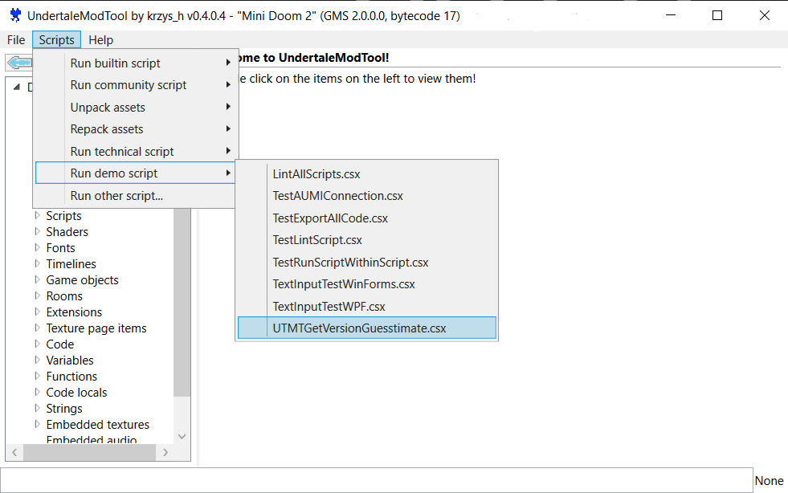
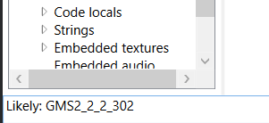
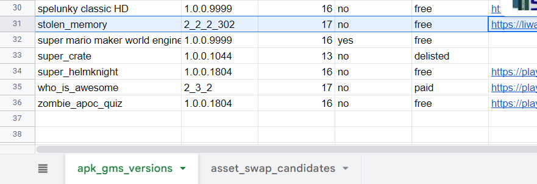
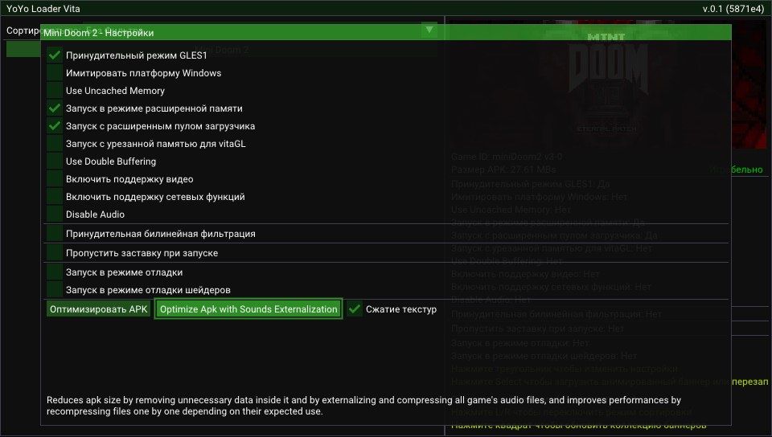

# Инструкция  по запуску GameMaker ПК игр на YoYo Loader  Vita

*На примере, я буду портировать игру Mini Doom* 2.

> ### **Внимание:** инструкция работает не на все игры. Так же автор не гарантирует идеальной работы. 
>
> За основу взята инструкция на английском языке из [GitHub.](https://gist.github.com/CatoTheYounger97/fa47e7eef92f772e4004d4dac22f9bdb) (Считайте что это перевод.)
>
> ## Что вы должны скачать:
>
> 1) [UndertaleModTool](https://github.com/krzys-h/UndertaleModTool)
> 2) [UTMTGetVersionGuesstimate.csx](https://gist.github.com/JohnnyonFlame/fdd79303423392c5911cf44eed9e17cb)
> 3) .apk Донор (дальше поймете что это)
>
> ## Подготовка программы:
>
> 1) Распакуйте  [UndertaleModTool](https://github.com/krzys-h/UndertaleModTool) в удобном вам месте.
>
> 2) Переместите файл **"UTMTGetVersionGuesstimate.csx"** в одну из корневых папок программы с названием оканчивающим на **"scripts"**. (Например **"DemoScripts"**)
>
>    ## Этап 1: **Проверка на YYC** 
>
>    1) Откройте папку с игрой (если игра в виде .exe файла, то откройте через архиватор и распакуйте файлы в удобное вам место).
>
>    2) Найдите файл игры **"data.win"** и откройте ее в программе. (Можно просто перетащить файл в окно)
>
>    3) Если программа вывела **"This game uses YYC"**, то увы ее нельзя портировать. 
>
>       > ### **Прошу так же заметить: Версии для Linux|MacOs не используют YYC. В крайнем случае проверьте их если они есть.** 
>
>    ##  Этап 2: **Проверка версии GMS и Bytecode** 
>
>    1) Запустите скрипт **"UTMTGetVersionGuesstimate.csx"**, перейдя во вкладку **"Scripts"** (местоположение скрипта зависит от выбранной вами папки сохранения файла. Пример: я сохранил скрипт в папку **"DemoScripts"**. Значит я должен перейти в **"Scripts" > "run demo script"**)
>
>       
>
>       После в левом нижнем углу должна появится информация о версии GMS. Bytecode можно увидеть в названии окна сверху.
>
>       
>
>       ## 3 Этап: Находим донора
>
>       1. Находим донора, точнее готовый .apk файл с нужной версии GMS. Слава небесам самому ничего искать не нужно, авторы оригинальной инструкцию оставили [ссылку на таблицу.](https://docs.google.com/spreadsheets/d/10H9lhwsLEO6b80UDT874QCRYq41FqcYqBFbB6QLwCTw/edit#gid=0) 
>
>       2. После перехода, находим игру с такой же версией GMS и скачиваем любым способом. (В моем случае это **"Stolen Memory"**)
>
>          
>
>       ## 4 Этап: Хирургическая операция
>
> 1) После скачивания .apk файла, открываем его через архиватор.
>
> 2) Находим папку **"assets"** и удаляем все файлы внутри (кроме **"splash.png"**)
>
> 3) Переименуйте файл игры  **"data.win"** в **"game.droid"**.
>
> 4) Переместите **"game.droid"** и другие игровые файлы в папку донора **"assets"**. (.exe и .dll файлы не нужны) 
>
>    ## 5 Этап: Добавление игры в эмулятор
>
>    1. Переименуйте .apk файл в **"game.apk"**.
>
>    2. Переместите его по следующему пути: **"ux0:data/gms/[название игры]/game.apk"** (папку с названием игры создаем сами).
>
>    3. Зайдите в эмулятор, выберите игру и откройте меню настроек на треугольник.
>
>    4. После в меню настроек игры выберите **"Optimise APK"**. Для некоторых игр лучше использовать **"Optimise APK with Externalisation"** с включенным параметром **"compressed textures".**
>    
>    Мои настройки игры Mini Doom 2:
>       
>      
> ## 6 Этап: Настройка управления
>      
>    1) Создайте файл **"keys.ini"** в папке с игрой на эмуляторе.
>      
>    2) Зная управление игры, настройте его по этой документации ниже.
>
>         ```
>         Чтобы связать кнопки геймпада и клавиатуры, значения нужно приравнять.
>     
>         Пример: congif для "Mini Doom 2":
>          ################################################################################################
>          CIRCLE=Q
>          CROSS=S
>          SQUARE=A
>          TRIANGLE=CTRL
>          SELECT=NUMPAD0
>          START=ENTER 
>          L1=ESC
>          L2=J
>          L3= 
>          R1=TAB
>          R2=SHIFT
>          R3=L
>          LEFT=LEFT
>          RIGHT=RIGHT
>          UP=UP
>          DOWN=DOWN
>     
>          ################################################################################################
>          Прошу заметить: все файлы "keys.ini" должны заканчиваться пустой строчкой.
>          ################################################################################################
>          
>          Все существующие значения для управления:
>     
>          Кнопки Playstasion Vita:
>     
>          CIRCLE
>          CROSS
>          SQUARE
>          TRIANGLE
>          SELECT
>          START
>          L1
>          L2
>          L3
>          R1
>          R2
>          R3
>          LEFT
>          RIGHT
>          UP
>          DOWN
>     
>          Аналоговые стики:
>          RANALOG=ON (Ввод мыши на правый стик. Привязка к центру стика.) 
>          RANALOG=ON2 (Ввод мыши на правый стик. Режим курсора) 
>          LANALOG=ON (Переназначение управление DPAD на левый стик, установленное пользователем в key.ini)
>     
>          Кнопки клавиатуры: 
>     
>          Буквы:
>          A-Z
>     
>          Цифры:
>          0-9
>     
>          Клавиши со стрелками:
>          UP
>          DOWN
>          LEFT
>          RIGHT
>     
>          Клавиши общих игровых действий:
>          ENTER
>          SHIFT
>          CTRL
>          ALT
>          ESC
>          BACKSPACE
>          TAB
>          " " (Пустой символ без кавычек является пробелом)
>     
>          Функциональные кнопки:
>          F1-F12
>     
>          Numpad:
>          NUMPAD0-NUMPAD9 
>     
>          Другие кнопки:
>          PRINTSCREEN
>          HOME
>          END
>          DEL
>          INS
>          PAGEUP
>          PAGEDOWN
>     
>          Кнопки мыши:
>          LMOUSE (Левая кнопка мыши)
>          RMOUSE (Правая кнопка мыши)
>              
>          Кодовые клавиши:
>          CODE0-CODE255
>          ```
> 
>   3. После запустите игру и убедитесь что вы настроили все правильно.
> 
>   ## Дополнительная информация
> 
>    *Yoyo Loader Vita (тут вы найдете всю информацию)([GitHub](https://github.com/Rinnegatamante/yoyoloader_vita))*
> 
>    *Таблица уже проверенных игр (обычно уже с готовыми конфигами и настройками YoYo Loader от других людей) ([GitGub](https://yoyo.rinnegatamante.it/))* 
> 
>    *Папка со всеми конфигами управления (можете отправить свои, для облечения жизни другим) ([GitHub](https://github.com/Rinnegatamante/yoyoloader_vita/tree/main/keymaps))*

